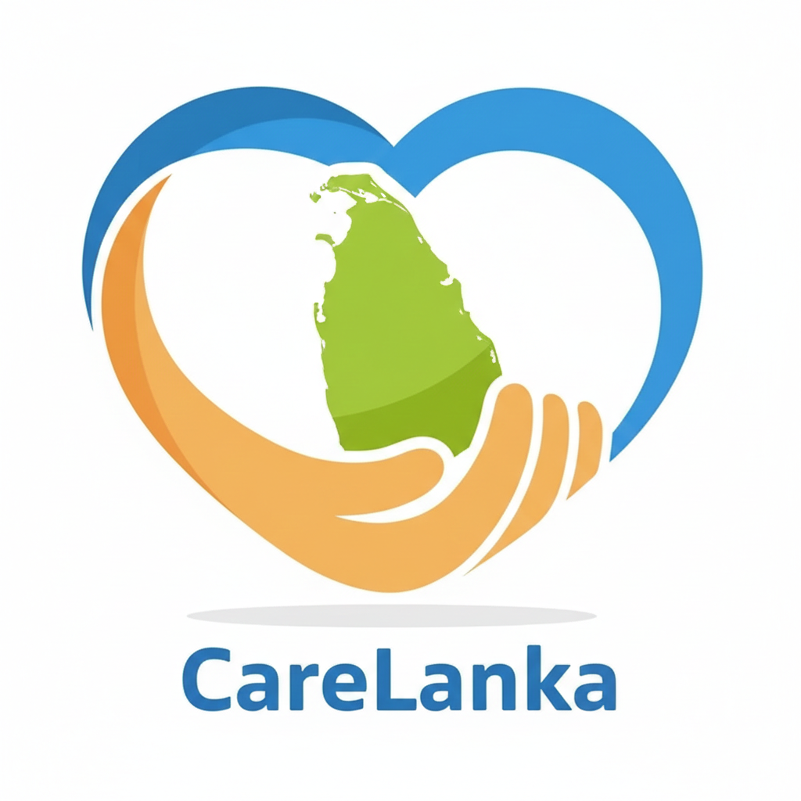
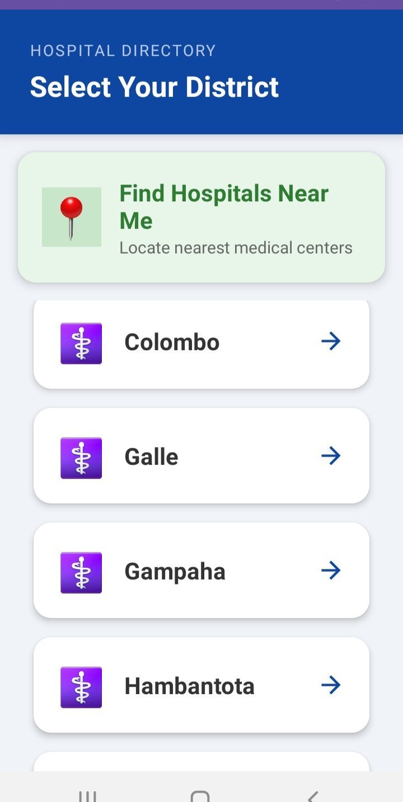
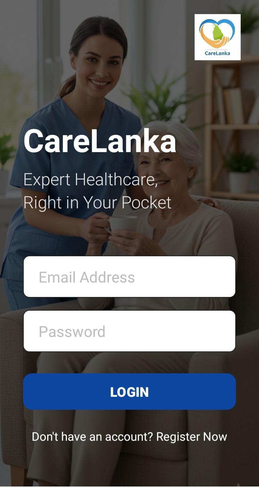
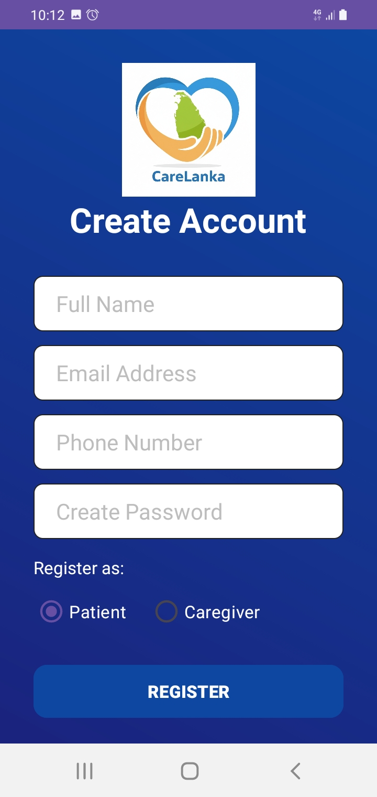
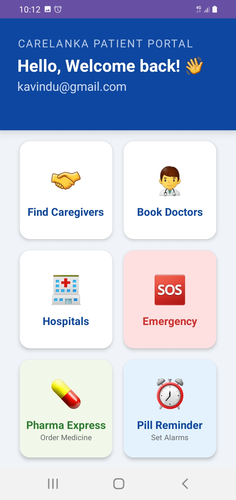
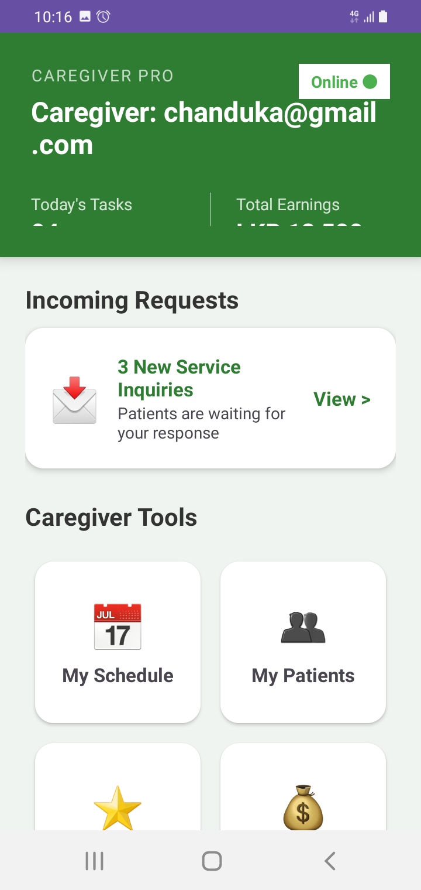
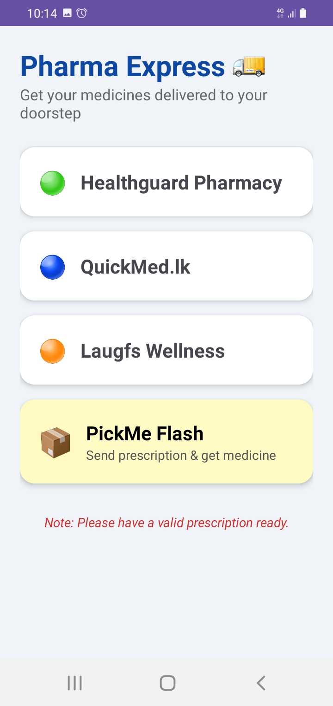
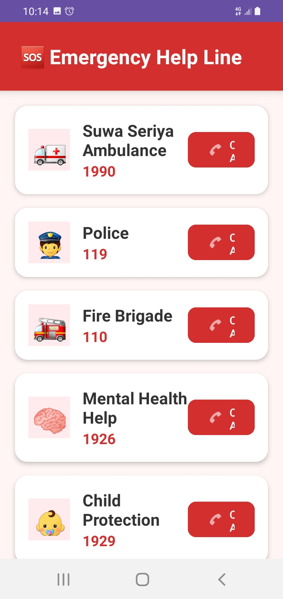
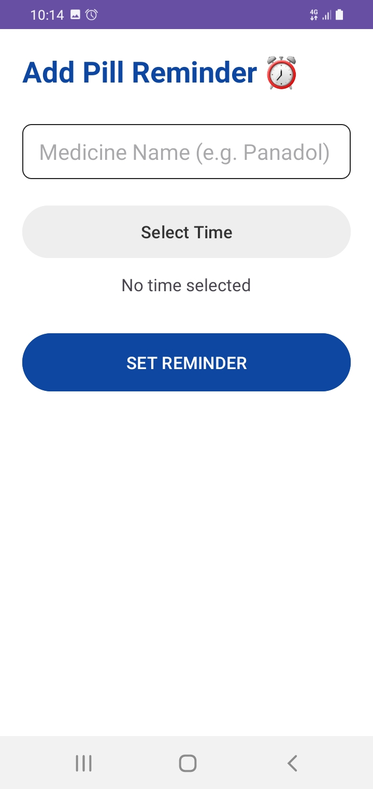

# 🌿 CareLanka – Digital Healthcare Companion 🇱🇰

<p align="center">
  
</p>

<p align="center">
  <b>Smart • Reliable • Sri Lankan Healthcare at Your Fingertips</b>
</p>

<p align="center">
  
  
  
  
</p>

---

## 🌍 About the Project

CareLanka is a Sri Lanka-focused digital healthcare Android application built using Java & Firebase.

It connects:

- 🧑‍⚕️ Patients  
- 👩‍⚕️ Caregivers  
- 🏥 Hospitals  
- 💊 Pharmacies  

All in one smart mobile solution designed for Sri Lankan healthcare needs.

---

# 🎥 Animated App Preview

<p align="center">
  
</p>

---

# 🚀 Core Features

## 🔐 Authentication System
- Firebase Email & Password Authentication
- Secure Login & Registration
- Role-based user access

---

## 🏥 Find Hospitals (Government & Private)

- View Colombo District hospitals
- Contact numbers included
- Google Maps integration
- Category filtering (Gov / Private)

<p align="center">
  
</p>

---

## 👨‍⚕️ Caregiver & Doctor Directory

- View doctor profiles
- Specialty filtering (Cardiologist, Pediatrician, etc.)
- Hospital association
- Contact details

<p align="center">
  
</p>

---

## 💊 Online Medicine Services
- Healthguard
- Laugfs Wellness
- QuickMed.lk
- PickMe Flash Delivery

---

## ⏰ Smart Reminder System
- Medicine alarm notifications
- Background AlarmManager
- High-priority alerts

---

## 🚑 Emergency Access
- Quick call emergency numbers
- 1990 Suwa Seriya Ambulance
- Fast-access interface

---

# 📸 Screenshots

## 🔐 Authentication

| Login | Register |
|-------|----------|
|  |  |

---

## 🏠 Main Features

| Dashboard | Caregiver | Online | Emergency | Reminder |
|-----------|-----------|--------|-----------|----------|
|  |  |  |  |  |

---

# 🛠 Tech Stack

| Layer | Technology |
|-------|------------|
| Language | Java |
| UI | XML + Material Design |
| Backend | Firebase Firestore |
| Authentication | Firebase Auth |
| Notifications | AlarmManager |
| Maps | Google Maps Intent API |

---

# ⚙️ Installation Guide

```bash
git clone https://github.com/sampleritgithubl/CareLanka.git
```

1. Open in Android Studio  
2. Sync Gradle  
3. Connect Firebase  
4. Add `google-services.json`  
5. Run on Emulator / Physical Device  

---

# 🧠 What I Learned

- Firebase Authentication integration
- Firestore CRUD operations
- Android lifecycle management
- Alarm & Notification handling
- Healthcare data structuring
- Google Maps integration

---

# 📈 Future Improvements

- Appointment booking system  
- AI symptom checker  
- Prescription storage  
- Sinhala & Tamil language support  

---

# 👨‍💻 Developer

Kavindu Rasanjana  
📧 kavindu20rasanjana@gmail.com  
🔗 https://github.com/sampleritgithubl  

---

# ⭐ Show Your Support

If you like this project, please ⭐ star the repository!
