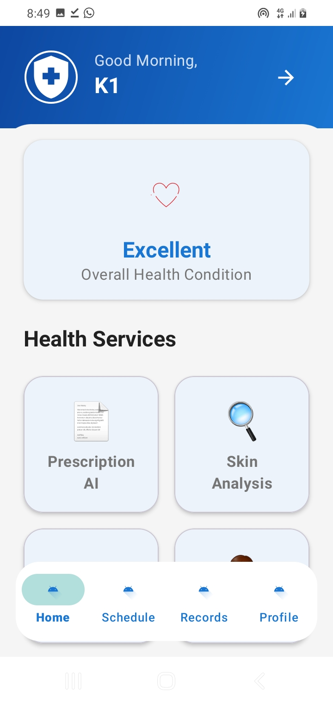

# 🇱🇰 CareLanka — AI-Powered Healthcare for Sri Lanka

> An all-in-one mobile healthcare platform that combines Google Gemini AI with practical, everyday health tools — built to make medical guidance accessible to every Sri Lankan, in their own language.

[](#)
[](#)
[](#)
[](#)

---

## 📖 Overview

CareLanka is a university final project built to solve a real problem in Sri Lankan healthcare: **language barriers, scattered information, and limited access to quick medical guidance**, especially in rural areas.

The app brings together an AI medical chatbot, AI-powered prescription and skin analysis, doctor/hospital discovery, emergency SOS, caregiver matching, and medication reminders — all wrapped in a single Android application that speaks Sinhala, Tamil, and English natively.

---

## ✨ Key Features

| Feature | Description |
|---|---|
| 🤖 **Multilingual AI Chatbot** | A Gemini-powered health assistant that understands and replies in Sinhala, Tamil, or English — no manual translation needed. Detects emergencies and recommends calling 1990 (Suwa Seriya) when symptoms sound serious. |
| 📄 **Prescription AI Reader** | Scans a photo of a handwritten or printed prescription, extracts medicine names and dosages, and explains them in Sinhala — then **automatically schedules medication reminders**. |
| 🔍 **Smart Skin Analysis** | Upload a photo of a skin concern and get a preliminary, plain-language AI observation — always paired with a clear medical disclaimer and a recommendation to see a dermatologist. |
| 🏥 **Doctor & Hospital Finder** | Search and filter specialists and hospitals across Sri Lanka by district. |
| 🚨 **SOS / Emergency Panic Button** | One-tap emergency alert to notify relevant contacts/services instantly. |
| 🤝 **Caregiver Matching** | Find experienced, vetted caregivers for elderly or recovering patients. |
| ⏰ **Medication Reminders** | Smart, schedulable reminders so doses are never missed. |
| 💊 **Online Pharmacy Integration** | Order medicines for home delivery directly from the app. |
| 🌍 **Full App Localization** | Every screen — not just the AI features — works in Sinhala, Tamil, and English using Google ML Kit. |

---

## 🛠️ Tech Stack

**Language:** Java

**AI / ML**
- Google Gemini API (`gemini-2.5-flash`) — via direct REST calls (OkHttp)
- Google ML Kit — Language Identification & On-Device Translation

**Backend**
- Firebase Authentication
- Firebase Firestore
- Firebase Realtime Database

**Architecture**
- MVVM (Model-View-ViewModel)
- Hilt (Dependency Injection)
- WorkManager (background scheduling for reminders)

**Networking**
- OkHttp (REST API calls to Gemini)
- org.json (request/response parsing)

---

## 🧠 Why Direct REST API Instead of the Gemini SDK?

An early version of this project used the official `generativeai` Android SDK. During development, Google **deprecated and shut down** the `gemini-1.5-flash` model family the SDK depended on, and the SDK itself had a recurring response-parsing bug (`kotlinx.serialization.MissingFieldException`).

To keep the app stable and future-proof, all Gemini calls were rebuilt as **direct REST API calls using OkHttp**, talking to `gemini-2.5-flash` directly over `https://generativelanguage.googleapis.com`. This removes the SDK dependency entirely and gives full control over request/response handling, error states, and model upgrades going forward.

---

## 📱 Screenshots

> _Add screenshots here — see the "Adding Screenshots" section below._

| Home | AI Chatbot | Prescription Reader | Skin Analysis |
|---|---|---|---|
|  |  |  |  |

---

## 🎥 Demo Video

[](#)
<!-- Replace # with your YouTube/Drive link once uploaded -->

---

## 🚀 Getting Started

### Prerequisites
- Android Studio (latest stable)
- JDK 11+
- A Google Gemini API key ([Google AI Studio](https://aistudio.google.com/app/apikey))
- A Firebase project (for Auth/Firestore/Realtime DB features)

### Setup

1. Clone the repository
   ```bash
   git clone https://github.com/YOUR_USERNAME/CareLanka.git
   cd CareLanka
   ```

2. Add your Gemini API key to `local.properties` (create this file in the project root if it doesn't exist):
   ```properties
   GEMINI_API_KEY=your_api_key_here
   ```

3. Add your own `google-services.json` (Firebase config) to the `app/` directory.

4. Open the project in Android Studio, let Gradle sync, then Run ▶️

> ⚠️ Never commit `local.properties` or `google-services.json` — both are git-ignored by default in this repo.

---

## 📂 Project Structure

```
app/src/main/java/com/example/carelanka/
├── PrescriptionAIActivity.java     # AI prescription scanning + auto reminders
├── MultilingualAIActivity.java     # AI chatbot (Sinhala/Tamil/English)
├── SkinAnalysisActivity.java       # AI skin condition analysis
├── ChatAdapter.java / ChatMessage.java
├── AlarmReceiver.java / ReminderActivity.java
└── ...
```

---

## 🎓 Academic Context

This project was developed as a final-year individual project for [Your Module/Course Name] at [Your University Name]. It demonstrates practical application of:
- Mobile application development (Android, Java)
- Generative AI integration (Gemini API)
- On-device machine learning (ML Kit)
- Cloud backend services (Firebase)
- Software architecture patterns (MVVM, DI)

---

## 👤 Author

**Kavindu Rasanjana**
Full Stack Developer | Sri Lanka

- GitHub: [@sampleritgithubl](https://github.com/sampleritgithubl)
- LinkedIn: [your-linkedin](https://linkedin.com/in/your-linkedin)
- Portfolio: [kavindu-rasanjana.me](https://kavindu-rasanjana.me)

---

## 📄 License

This project is submitted as academic coursework. Feel free to explore the code for learning purposes.
